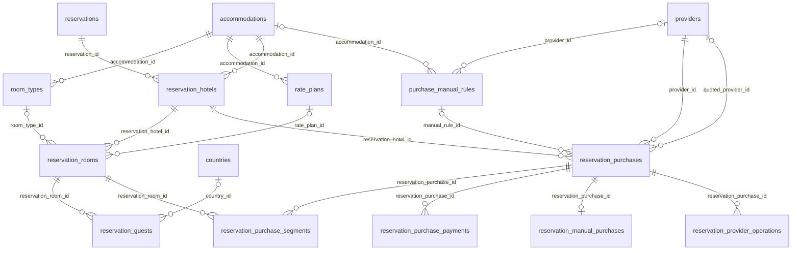
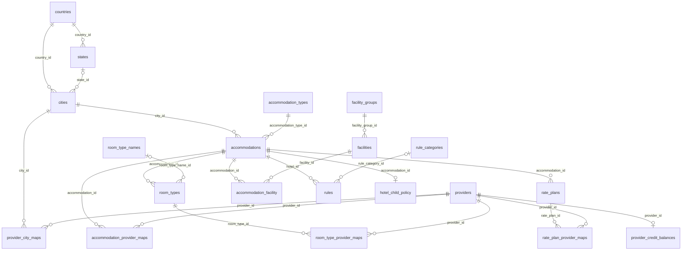
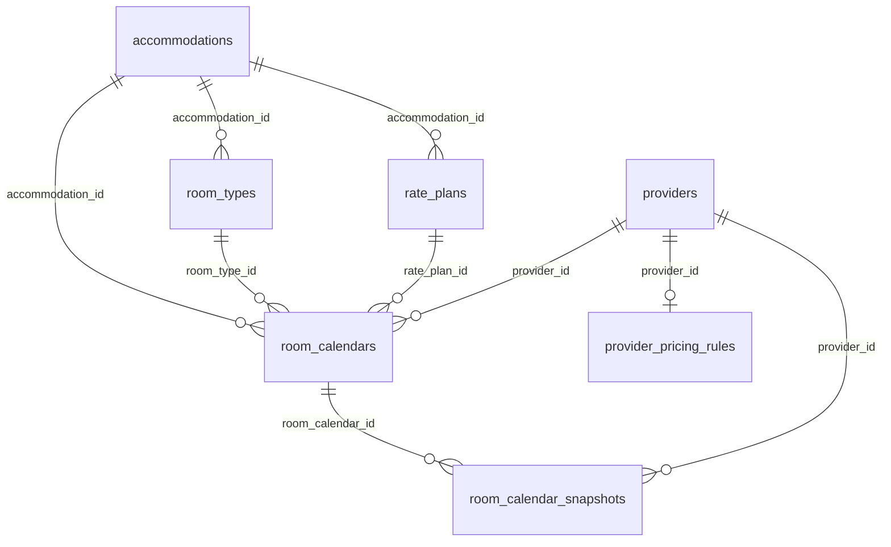

# Domestic Hotel GDS - Database Architecture

**Branch:** `feature/reservation-foundation`  
**Snapshot date:** 2026-09-15  
**Purpose:** management review of the implemented business schema and relationships.

## Executive model

The business schema is grouped into six domains: Location, Provider Integration, Hotel Catalog, Availability & Pricing, Reservation, and Procurement & Payment.

## Reservation & procurement ERD

## Catalog & provider ERD

## Availability & pricing ERD

## Open decisions before schema approval

1. `PROJECT_CONTEXT.md` specifies an internal GDS reservation reference, but the current `reservations` migration has no reference column.
2. `PROJECT_CONTEXT.md` specifies `quantity` for purchase segments, but the current `reservation_purchase_segments` migration has no `quantity` column.
3. `is_final` exists on hotel and room candidates, but uniqueness of a single final candidate is not enforced by a dedicated database constraint.
4. Some legacy catalog migrations still use database ENUM columns (`rate_plans`, `hotel_child_policy`).

## Deliverable sources

- `docs/database/domestic_hotel_schema.dbml` - editable ERD source for dbdiagram.io-compatible tools.
- This file - GitHub-native Mermaid view for reviews.
